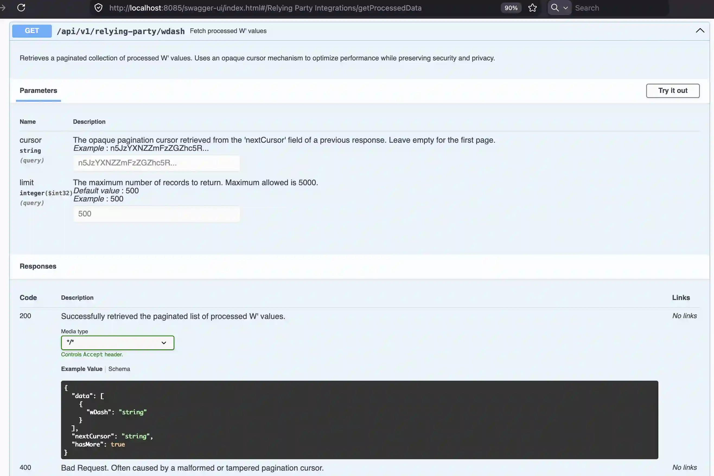
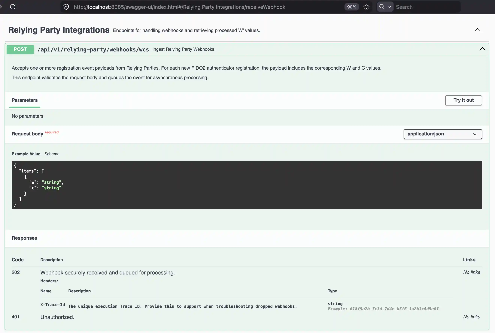
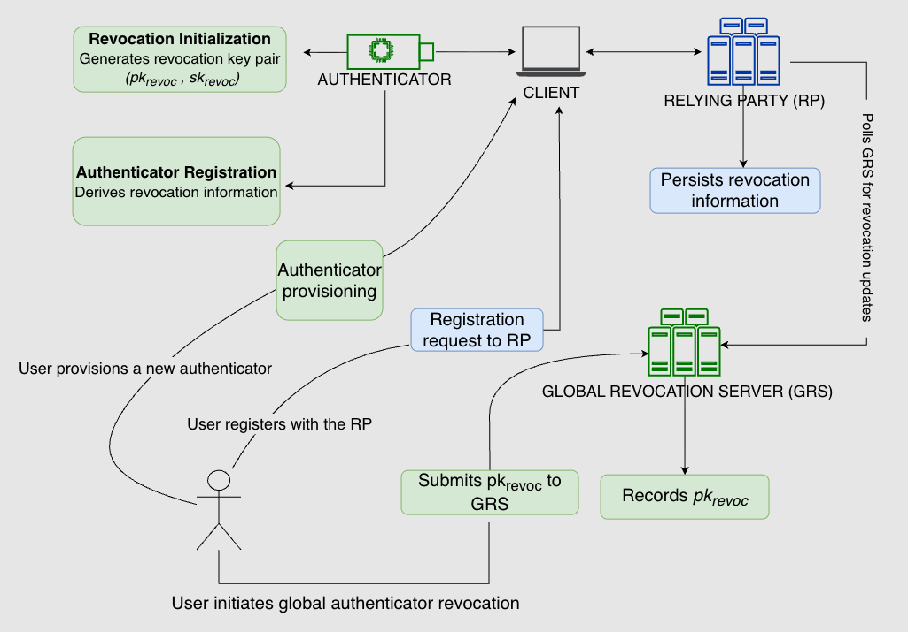
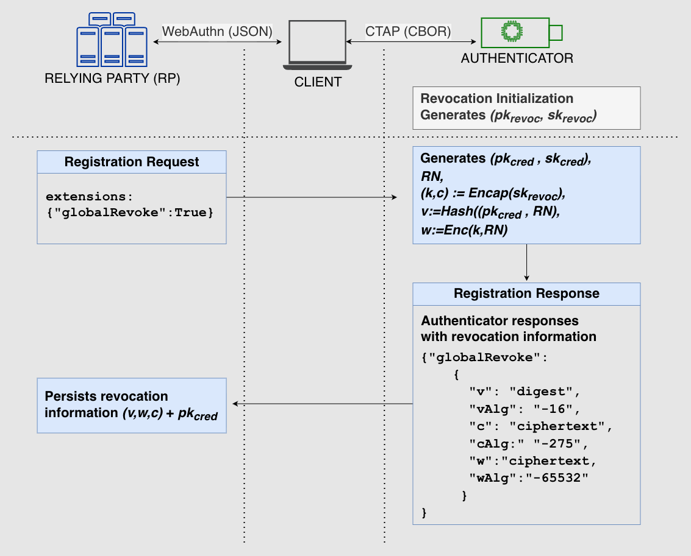

# Secure and Privacy-Preserving Global Revocation for FIDO2-Based Systems

This repository contains the proof-of-concept implementation of global revocation for FIDO2 authenticator. It provides
supplementary material for our research paper, "Secure and Privacy-Preserving Global Revocation for FIDO2-based
Systems."

In this repository, we show how our concept can be implemented across all parts of the FIDO2 stack: on the authenticator
(hardware token), on the relying party server, and as an integration with the Global Revocation server.

> [!NOTE]
> The names used in this repository correspond to the terminology in our research paper. We recommend reading the
research paper to fully understand the underlying concepts.

Watch our proof-of-concept demo:

<video src="https://npcraft.com/videos/demo-proof-of-concept.mp4" controls="controls" width="600">
</video>

# Implementations

Following components are part of the proof-of-concept demo.

| Directory                                                         | Description                                  |
|-------------------------------------------------------------------|----------------------------------------------|
| [poc-authenticator](apps/poc-authenticator)                       | Raspberry Pi Pico RP2040 as an Authenticator |
| [poc-global-revocation-server](apps/poc-global-revocation-server) | Global Revocation Server for FIDO2           | 
| [poc-relying-party](apps/poc-relying-party)                       | FIDO2 Relying Party                          |

# Authenticator: Raspberry Pi Pico RP2040 Microcontroller

Our demo FIDO2 authenticator is built on a Raspberry Pi Pico (RP2040) with an attached display, which shows the Global
Revocation Key as a QR code. See the [README.md](apps/poc-authenticator/README.md) file in
the [poc-authenticator](apps/poc-authenticator) directory for instructions on building and setting up the hardware.

  
<strong> 📸 Click to view screenshot of POC Authenticator 📸 </strong>

### Raspberry Pi Pico RP2040 as FIDO2 Authenticator with attached Display showing Global Revocation Key

  

# Global Revocation Server for FIDO2: Java Web App

Our demo Global Revocation Server is a Java web application. For instructions on building and running the web app, see
the [README.md](apps/poc-global-revocation-server/README.md) file in
the [poc-global-revocation-server](apps/poc-global-revocation-server) directory. For the architectural decisions made in
this project, see the [README.md](apps/poc-global-revocation-server/docs/adr/README.md) file in
the [adr](apps/poc-global-revocation-server/docs/adr) directory.

  
<strong> 📸 Click to view screenshots of POC Global Revocation Server 📸 </strong>

### Global Revocation Key Submission

  

### Global Revocation Key validation

  

   

### API Overview

  

### GET API Endpoint

  

### POST API Endpoint

   

# Relying Party: Java Web App

Our demo Relying Party web application is a Java web application. See the [README](apps/poc-relying-party/README) file
in the [poc-relying-party](apps/poc-relying-party) directory for more information on how to set up and run the web app.

  
<strong> 📸 Click to view screenshots POC Relying Party 📸 </strong>

### Authenticator Response (v, w, c) Processed by the Relying Party

  

### Authenticator Response – (v, w, c) Included in Extension

  

### Relying Party – Authenticator Already Revoked

   

# Concept Overview

# Global revocation extension process during FIDO2 registration

# Revocation information

> [!NOTE]
> Randomly generated Revocation information for each FIDO2 registration

The following table shows how revocation information is generated.

|             |                                                       |
|-------------|-------------------------------------------------------|
| RN          | Randomly generated Revocation Nonce                   |
| Reverse KEM | (k,c) <— Encap(sk_revoc)                              |
| k           | Randomly generated symmetric key                      |
| c           | KEM ciphertext (the encapsulated representation of k) |
| v           | Hash(pk_cred, RN)                                     |
| w           | Enc(k,RN)                                             |

* Key Encapsulation Mechanism (KEM)

# Knowledge scope

The following table shows the knowledge scope of each component. This is by design: each component knows only a specific
part of the revocation information.

| Component     | Knowledge Scope                                     |
|---------------|-----------------------------------------------------|
| Authenticator | (pk_revoc, sk_revoc), (pk_cred, sk_cred), (v, w, c) |
| RP            | pk_cred, (v, w, c)                                  |
| GRS           | pk_revoc, (w, c)                                    |

## Licensing and Attributions

The original code in this repository is licensed under the [Apache License, Version 2.0](./LICENSE).

This monorepo also contains modified versions of third-party open-source projects. For a complete list of third-party
code, original authors, and base commit hashes, please see [CREDITS.md](./CREDITS.md).
