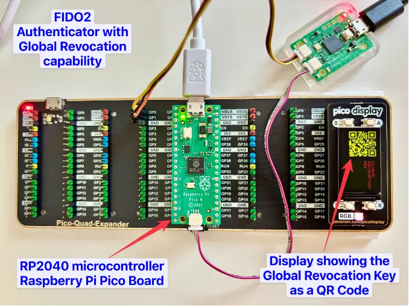
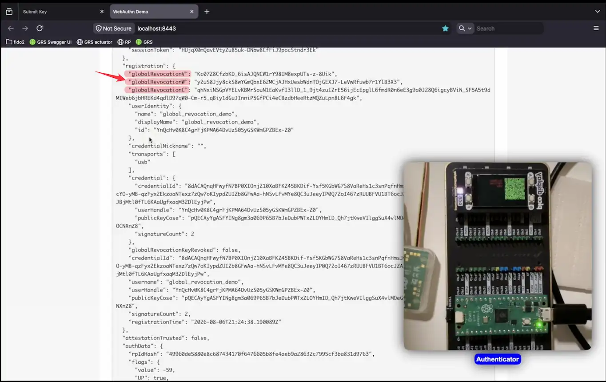
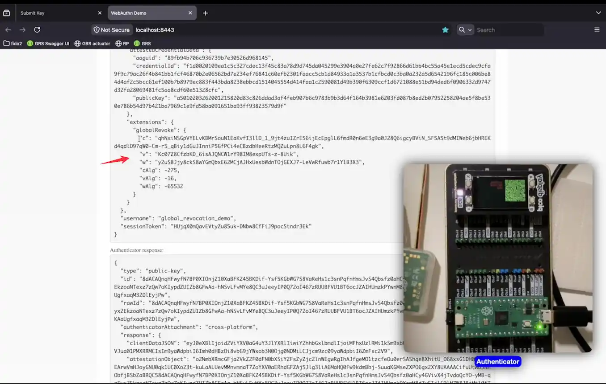
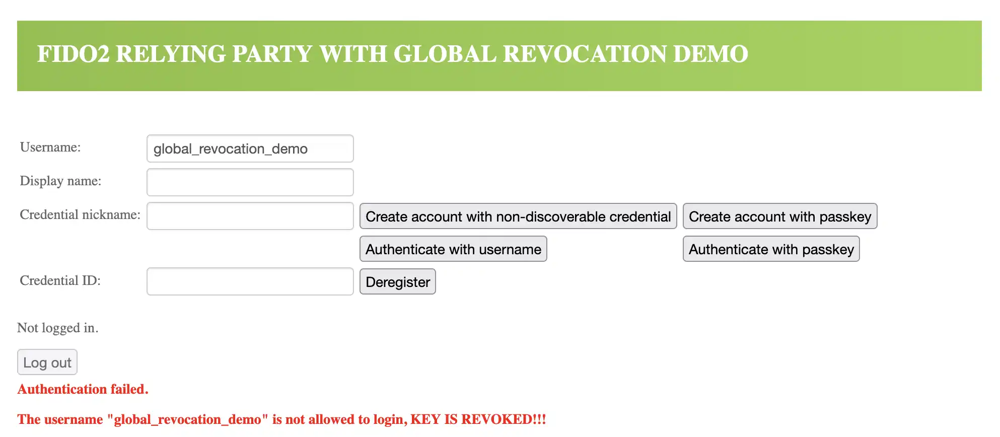

# Secure and Privacy-Preserving Global Revocation for FIDO2-Based Systems

This repository contains the proof-of-concept implementation of global revocation for FIDO2 authenticator. It provides
supplementary material for our research paper, "Secure and Privacy-Preserving Global Revocation for FIDO2-based
Systems."

In this repository, we show how our concept can be implemented across all parts of the FIDO2 stack: on the authenticator
(hardware token), on the relying party server, and as an integration with the Global Revocation server.

Watch our proof-of-concept demo:

# Implementations

We have implemented following components.

| Directory                                                         | Description                                  |
|-------------------------------------------------------------------|----------------------------------------------|
| [poc-authenticator](apps/poc-authenticator)                       | Raspberry Pi Pico RP2040 as an Authenticator |
| [poc-global-revocation-server](apps/poc-global-revocation-server) | Global Revocation Server for FIDO2           | 
| [poc-relying-party](apps/poc-relying-party)                       | FIDO2 Relying Party                          |

  
<strong> 📸 Click to view screenshots POC Authenticator 📸 </strong>

### Raspberry Pi Pico RP2040 as FIDO2 Authenticator with Global Revocation Display

  

  
<strong> 📸 Click to view screenshots POC Relying Party 📸 </strong>

### Authenticator Response (v,w,c) Processed by the Relying Party

  

### Authenticator Response – (v,w,c) Included in Extension

  

### Relying Party – Authenticator Already Revoked

   

  
<strong> 📸 Click to view screenshots POC Global Revocation Server 📸 </strong>

### Global Revocation Key Submission

  

### Global Revocation Key validation

  

   

 

