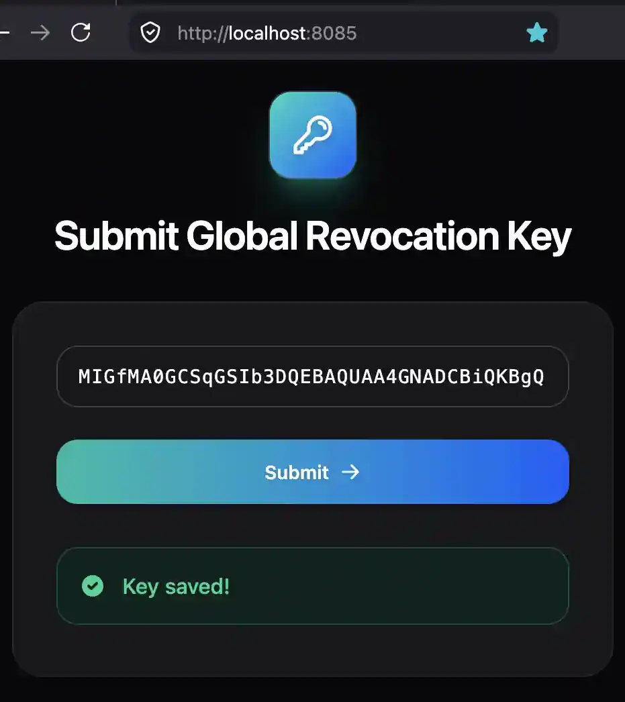
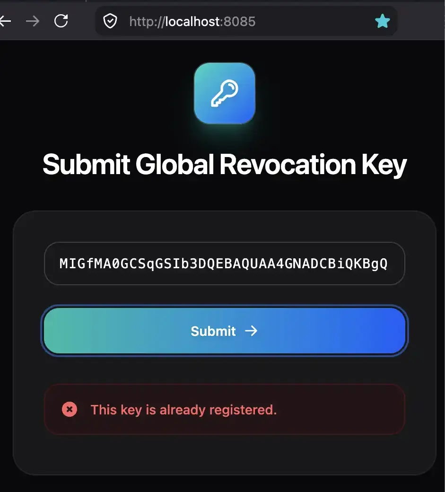
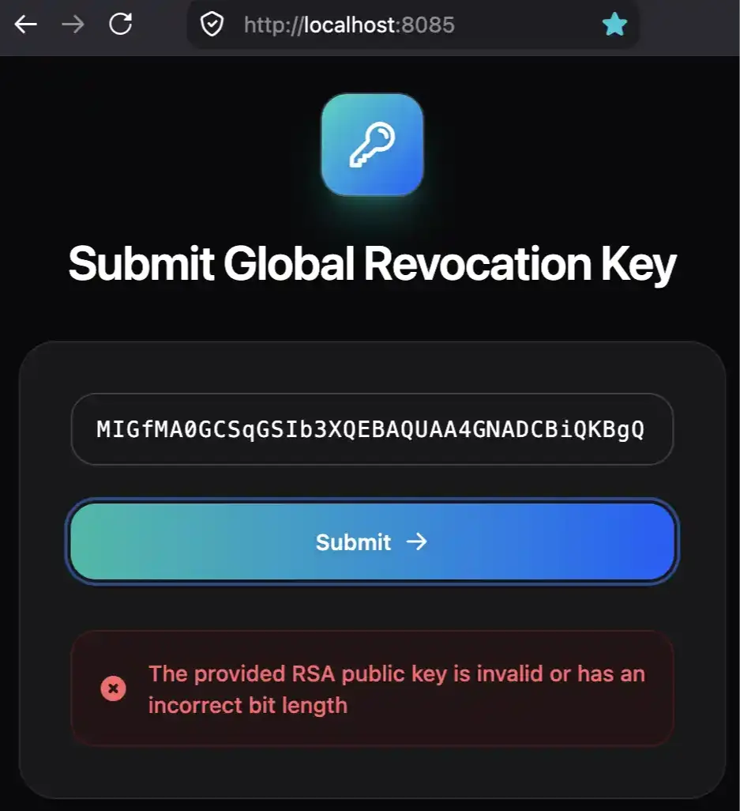
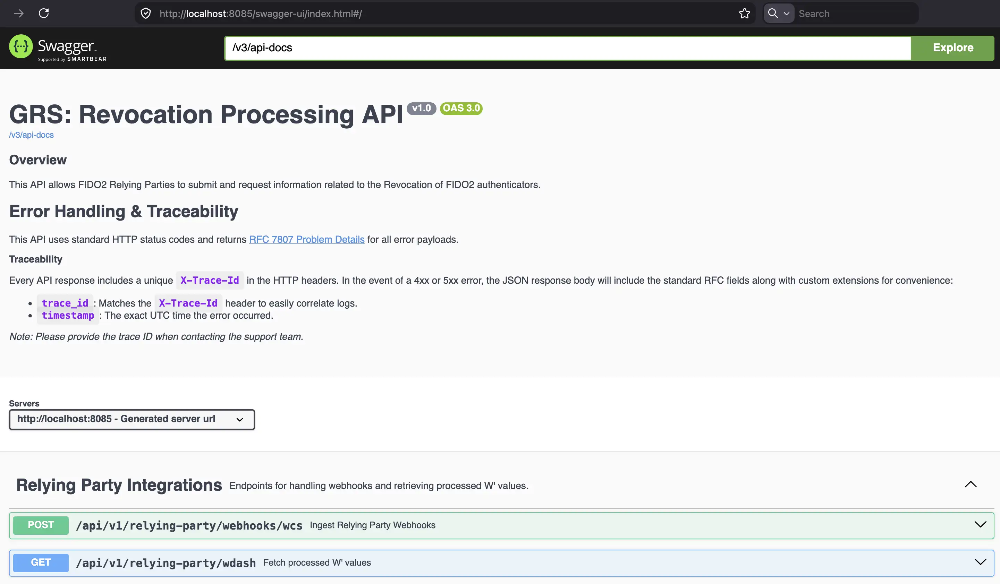

# Global Revocation Server

## Description

This repository contains the proof-of-concept implementation for the Global Revocation Server for FIDO2. It provides
supplementary material for our research paper, "Secure and Privacy-Preserving Global Revocation for FIDO2-based
Systems".

> [!NOTE]
> The names used in this repository correspond to the terminology in our research paper. We recommend reading the
research paper to fully understand the underlying concepts.

## Tech Stack

* **Framework:** Spring Boot 3.x
* **Language:** Java 21
* **Database:** PostgreSQL 17.x
* **Database Migrations:** Liquibase

## Prerequisites

Before you begin, ensure you have the following installed:

* [JDK 21](https://adoptium.net/) (or higher)
* [Rancher Desktop](https://rancherdesktop.io/) (for running a local database)
* Note: You do not need to install Gradle. This project uses the Gradle Wrapper (gradlew).

## Architecture & Technical Decisions

To understand why specific patterns or technologies were chosen, please read
our [Architecture Decision Records (ADRs)](docs/adr/README.md).

## Getting Started

**1. Clone the repository**

**2. Start Rancher Desktop**
This will be required to spin up the database container.

**3. Run the application**

```bash
./gradlew bootRun --args='--spring.profiles.active=local'
```

**4. Testing**

Run all tests (Unit and Integration):

```bash
./gradlew test
```

**5. Build the application**

```bash
./gradlew build
```

## Configuration

This application is configured via the `src/main/resources/application.yaml` file.

## Submit Global Revocation Key

Once the application is running, you can submit the Global Revocation Key using the following URL:

- http://localhost:8085/

<details>
  <summary><strong> 📸 Click to view screenshots 📸 </strong></summary>

### Key Submission

  

### Key validation

  

   
</details>

## FIDO2 Relying Party Integration

FIDO2 Relying Parties can submit and request information related to the Revocation of FIDO2 authenticators, via REST
API.

<details>
  <summary><strong> 📸 Click to view screenshots 📸 </strong></summary>

### General API Overview

  

### GET API Endpoint

  

### POST API Endpoint

   
</details>

### API Documentation

Once the application is running, the REST API documentation is available via Swagger UI:

* **Swagger UI:** [http://localhost:8085/swagger-ui/index.html](http://localhost:8085/swagger-ui/index.html)
* **OpenAPI Spec:** [http://localhost:8085/v3/api-docs](http://localhost:8085/v3/api-docs)

## Helpful Links

* **Application Info:** [http://localhost:8085/actuator/info](http://localhost:8085/actuator/info)
* **Health Check:** [http://localhost:8085/actuator/health](http://localhost:8085/actuator/health)

